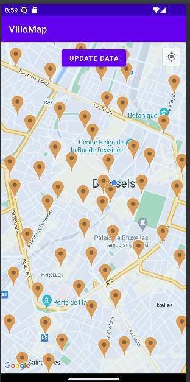

# VilloMap

This project represents an Android Phone application where you can view OPEN Villo bicycle locations on a map interface. It fetches the Villo location data from https://data.mobility.brussels/nl/info/villo/ .

# Software Used

* Android Studio Dolphin 2021.3.1

* API SDK: 21 Android (Lollipop)

(Tested and worked on Pixel phone 3a API 33 x86_64)

# Setting up the project

If you initialized the project on your local setup, you will need to create your google maps android SDK API key and add a variable MAPS_API_Key=<your key here> in your local.properties file to make the google maps work.

# Features

* Displaying all OPEN Villo bicycle locations
* Pulling Villo data from https://data.mobility.brussels/geoserver/bm_bike/wfs?service=wfs&version=1.1.0&request=GetFeature&typeName=bm_bike:villo&outputFormat=json&srsName=EPSG:4326 on First startup or if existing data is older than 15 min
* Displaying latest or stored data pulled from the Villo API
* Refresh button to forcefully refresh all data pulled from https://data.mobility.brussels/geoserver/bm_bike/wfs?service=wfs&version=1.1.0&request=GetFeature&typeName=bm_bike:villo&outputFormat=json&srsName=EPSG:4326
* Persisting Data 
* Fetching Data from internal storage if already exists
* Tapping Markers/Annotations of bicycle locations redirects you to google Maps app with the use of Intents and automatically shows the direction you have to take while walking.
* User location will be shown if given permission
* Camera moves/zoom in to user location or one of the bicycle locations upon start up or data update.
* Little button top right of the map to relocate to use location.
* 1 Example of a Junit test but it is bugged as I need to correctly implement the mocking setup

# Known Bugs

* Unsure if user location will be updated if they move. (I tried implementing this, but had a lot of permission/version issues and eventually gave up)
* There is currently no other language support except english
* My Junit Example of testing the download and storing of the data has an 'android.os.Looper not mocked' error.

# References
I used several tutorials to help me during this project:

* Android online beginner course: https://developer.android.com/courses/android-basics-kotlin/course
* Fixed a bug where design preview would not show by changing tools:layout: https://stackoverflow.com/questions/23898992/android-studio-google-map-v2-fragment-rendering
* Install failure of emulator: https://stackoverflow.com/questions/4709137/solution-to-install-failed-insufficient-storage-error-on-android
* Info about Using permissions: https://stackoverflow.com/questions/40142331/how-to-request-location-permission-at-runtime
* Git Repo about easy permissions: https://github.com/googlesamples/easypermissions
* Get Request on a url using retrofit: https://www.youtube.com/watch?v=sRLunCZX2Uc
* Permission and user location implementation: https://developers.google.com/maps/documentation/android-sdk/location#kotlin
* Waiting while handling other things: https://stackoverflow.com/questions/45213706/kotlin-wait-function
* Getting current time: https://stackoverflow.com/questions/47006254/how-to-get-current-local-date-and-time-in-kotlin
* Adding a marker on click listener: ChatGPT + https://stackoverflow.com/questions/57632757/open-a-new-page-when-marker-clicked-on-map-android-studio
* Clicking a marker opens up google maps app with destination: https://stackoverflow.com/questions/2662531/launching-google-maps-directions-via-an-intent-on-android
* Google maps urls: https://developers.google.com/maps/documentation/urls/get-started
* Storing Data classes into internal storage: ChatGPT + https://stackoverflow.com/questions/54512254/saving-a-class-to-internal-storage-on-android-kotlin + https://stackoverflow.com/questions/46376108/unable-to-access-variable-from-innerclass-kotlin-android + https://stackoverflow.com/questions/65550973/android-with-kotlin-best-ways-to-storage-a-custom-class + https://www.javatpoint.com/kotlin-android-read-and-write-internal-storage + https://www.javatpoint.com/kotlin-android-read-and-write-internal-storage
* Fixing junit import bug: https://stackoverflow.com/questions/71429854/could-not-find-org-junit-jupiterjunit-jupiter